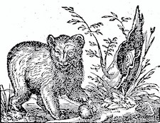

# grizzly



Extra utilities for [Bear.app](https://bear.app/).

## Library

To use `grizzly` as a library, just do `go get github.com/ruivieira/grizzly` or add it
to your `go.mod`.

## CLI

To use the CLI, just do

```shell
$ cd grizlly
$ go build
```

### CLI commands

* `-d`, Show duplicate titles and counts
* `-ts`, Suggest tag for given title (based on your data)
* `--tail n`, `--head n`, Show first or last `n` entries, in order
* `-m`, Show all marked text for all notes
* `-u`, Show all notes which are not referenced anywhere
* `-s`, `--search`, Search notes using partial title